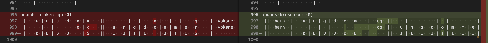
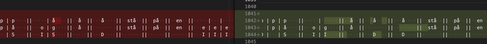

# Match 'Em!

The goal of this package is to extend/modify word alignment and error calculations to better understand the sorts of errors that wav2vec2 (and other ASR able to output sub-words) is making. This has resulted in alignments that consider word similarities and tries to create the best possible, human-like alignment between two word streams. 

### Table of contents

- [Installation](#installation)
- [Implementation details](#implementation-details)
  - [Reading generated alignments](#reading-generated-alignments)
  - [Distance calculation methods](#calculating-distance-and-backtrace)
  - [Character vectors](#character_vectors)
  - [Compounding](#compounding)
  - [Greater than 1 substitution cost](#greater-than-1-dynamic-substitution-cost)
- [Usage](#usage)
  - [Code usage](#code-usage)
  - [The results object](#the-results-object)
  - [Accessing human readable alignments](#reading-the-alignments)

## Installation

This package can be pip installed and thus imported into code regarless of it's relationship to this directory. 

To pip install 

1. Nativate to this `match_em` directory
2. Run `pip install .` 

## Implementation details

### Reading generated alignments

I feel that it is best to take a moment, before we find ourselves elbow deep in the implementation, to describe the word alignments that will be used as references throughout. Thus, a word and character level alignment generated by Match 'em looks like this:

```
  f | r | å    ||  neste  ||   v | e | k | e    ||   a | v    ||   v | a | r | t    ||  altså  || 
  f | r | a    ||  neste  ||   v | e | k | a    ||     |      ||   v | a | r |      ||  altså  || 
    |   | S    ||         ||     |   |   | S    ||   D | D    ||     |   |   | D    ||         || 
``` 

In this alignment you can see that a word-level alignment was done first. Then, for the words that didn't match up, a character level alignment was done to see which characters changed. Word boundries are denoted with a double pipe "||", and character boundries are denoted with a single pipe "|". The edit operations are abreviated to a single letter. "I" for insertion, "D" for deletion, and "S" for substitutions. 

### Calculating distance and backtrace

There are 3 separate ways of calculating the distances between sentences. The first method uses the well established [python-Levenshtein](https://pypi.org/project/python-Levenshtein/) package. This will work quickly and well for most sentence pairs. However, since the inital distance computation is done at the word level, without regard to the similarity of words, there are instances where the word-level alignment does not match up with human alignment intuition. To illustrate this we'll use the following example phrases. 

**REF:** "frå neste veke av vart altså"

**HYP:** "fra neste veka var altså"

There are many substitutions in this reference as well as a deleted word ("av"). Therefore, with all word substitutions being equally weighted, there are 3 equal alignment options

```
 frå  ||  neste  ||  veke  ||   av   ||  vart  ||  altså  || 
 fra  ||  neste  ||        ||  veka  ||  var   ||  altså  || 
  S   ||         ||   D    ||   S    ||   S    ||         || 


 frå  ||  neste  ||  veke  ||   av   ||  vart  ||  altså  || 
 fra  ||  neste  ||  veka  ||        ||  var   ||  altså  || 
  S   ||         ||   S    ||   D    ||   S    ||         || 


 frå  ||  neste  ||  veke  ||   av   ||  vart  ||  altså  || 
 fra  ||  neste  ||  veka  ||   var  ||        ||  altså  || 
  S   ||         ||   S    ||   S    ||   D    ||         || 
```

The Levenshtein distance calculation generates the first alignment. However, when a human looks at the alignment options we prefer the second one. With the second one there are only 1 letter differences for "veke" and "vart". Hence, we want a method that will consider the distances beween words when doing the distance calculation and thus (hopefully) generate an alignment that makes sense to human readers. 

To facilitate this, a manual implementation of distance and backtracing has been created. This can eithere be run with equal weights for all edits (insertions, substitution , and deletions) or with a dynamic substitution cost that is conditioned on the distance between candiate words. That is, instead of the substitution cost always being 1, it is the CER between the two substitution candiates if the CER is less than 1. (NOTE: Investigation into allowing the substitution cost to be > 1 has been done. The results can be found [below](#greater-than-1-dynamic-substitution-cost)). These different distance methods can be specified when calling `compute_mistakes`.

### Character vectors

To align characters within words we require some way of determining which characters should be aligned with eachother. Therefore, we used the same methodology as described above for words (that a distance metric would dictate the cost for aligning characters) utilizing character vectors as a way of determining distance. These vectors are defined using the articulatory position commonly associated with that letter. This is a far from perfect system (different languages have different strength of correlation between characters and phonemes, ignores di- and tri-graphs, and so on) but does allow us to align characters along largely logical lines.

These vectors can be found in `.match_em/character_data/character_traits.json`. Here each letter vector inventory is defined by language code (e.g. "no" for Norwegian). Consonant, vowels, and punctuation are defined for each letter

#### Consonant vectors 

| vector value | voiced | class     | nasal | place        | lip rounding | 
|--------------|--------|-----------|-------|--------------|--------------|
|  0           | false  | stop      | false | bilabial     | false
|  1           | true   | affricate | true  | labio-dental | true
|  2           |        | trill     |       | alveolar     |      
|  3           |        | fricative |       | retroflex    |      
|  4           |        | approx    |       | palatal      |      
|  5           |        |           |       | velar        |      
|  6           |        |           |       | uvular       |      
|  7           |        |           |       | glottal      | 

Thus a vector like `[1, 0, 1, 2, 0]` would represent a voiced, nasal, alveolar stop /n/

#### Vowel vectors

| vector value | height | front/back | rouding |
|--------------|--------|------------|---------|
| 0            | high   | back       | false   |
| 1            | mid    | mid        | true    |
| 2            | low    | back       |         | 

Thus a vector like `[0, 2, 1]` would represent the high, back, rounded vowel /u/

### Compounding 

Once the distances and edit operations have been calculated via one of the distance methods metioned above we can check for compound word errors. Errors can occur one of two ways. Either a space was inserted into a compound word and thus 2 word were transcribed when only one should have been. For example "lo økonom" being transcribed as "loøkonom". Or, conversley, a space was removed and a compound word was transcribed when 2 separate words should have been. For example "passivhus" was transcribed as "passive hus".

To find these error we look at the wordl-level alignment and identify words that have either been inserted or deleted. We then attempted to attach the lone word to the words proceding and following it. If the number of character-level insertions/deletions is decreased we assume we have found a malformed compound and the lone word is attached to it's other part. As an example consider the following sentence alignment


```
  han  ||   h | e | r | f | r | a    ||     |   |      ||  evigheten  ||
  han  ||   h | e | r |   |   |      ||   f | r | a    ||  evigheten  ||
       ||     |   |   | D | D | D    ||   I | I | I    ||             ||
```

We can see that "fra" has been inserted but also that "herfra" has 3 deleted characters. We therefore try attaching "fra" to both the proceding and following words ("her" and "evigheten") and seeing if that decreased the number of deletions for the word it joins. When it joins "her" to make "herfra" we can see the number of deletions goes from 3 -> 0. And when it joins "evigheten" the number of deletions stays the same. Therefore, we assume that "herfra" was the actual target and add "fra" to "her" (but keep a space between them so later alignments will show that the compound was missed).

The number of compound word errors is tracked and can be useful for insights.

### Greater than 1 dynamic substitution cost

When doing a manual alignment as described [above](#calculating-distance-and-backtrace) we limited the dynamic substitution cost to being either the CER between the 2 target words or 1, whichever was smaller. However, we believed it was worthwhile to investigate the impact of allowing the substitution cost to be greater than 1. Here we report on some observations from this investigations 

The main take away seems to be that allowing the substitution cost to be greater than 1 baises the alignment towards substitution pairs that are more similar in length. Barring similar length substitution pairs it will prefer insertion and deletions to substitutions. The later point can be both good and bad for alignments. 

Here I've included some examples of alignments do demostrate these points. For all screenshots alignment with a substitution cost > 1 is on the right of the image. The alignment on the left is generated using the manual alignment but with substitution cost capped at 1.

Here we can see that the alignment will prefer to align "og"s even at the expense of both a deletion and insertions. Ultimately, in this case, this is a more correct alignment.


In this example we can see that the alignment prefers to have "og" by itself rather than as a substitution with "å". This is because the "og" being 2 characters incurs a greater than 1 cost when substituted with "å" which is only 1 character. This insertion rather than substitution is perhaps less correct than allowing one instance of "å" to be substituted with "og". (However, it's probably also worth noting that the intuition of "og"/"å" substitution acceptability relies on knowledge of how these are phonetically realized...that is, they're often phonetically identical.)


**TLDR:** I cannot see an obviously absolutely right answer to whether the sub cost should be allowed to be greater than 1  ¯\\_(ツ)_/¯

## Usage

### Code usage

The analysis can be inported into your Python code. The main method to use is `compute_mistakes`.  For example

```python
from match_em import analysis

ref = 'frå neste veke av vert altså'
hyp = 'fra neste veka var altså'

results = analysis.compute_mistakes(ref, hyp)


```
The `compute_mistakes` method will accept either a string referece text and hypothesis or a list of strings. If a list of strings is provided the results will be cumulative over the entire corpus of utterances provided. For example

```python
from match_em import analysis
import pandas as pd

sample_df = pd.read_csv('sample_df.csv')
sample_df.head(3)

references = list(sample_df['transcript_cleaned'])
hypotheses = list(sample_df['wav2vec'])
utt_ids = list(sample_df['utt_id'])

results = analysis.compute_mistakes(
    references, 
    hypotheses, 
    utt_ids, 
    distance_method='weighted_manual', 
    print_to_file='word_level_alignments_compounding_insertdelete_manualWeighted.txt'
)
```

Frequenly used metrics (WER and CER) can be accessed like so

```python
from match_em import analysis

computed_wer = analysis.wer(results)
computed_cer = analysis.cer(results)
```

### The results object

`compute_mistakes` returns a dictionary with the results from the text it analyzed. We'll describe each of the fields here.

* **word_level_errors:** aggregate count of errors (insertions, substitutions, and deletions) at the word level. Can be used to compute WER.

* **word_level_references:** aggregate count of words in the reference utterance(s). Can be used to compute WER.

* **char_level_errors:** aggregate count of character errors (insertions, substitutions, deletions). Performed without first doing word alignment. Can be used to compute CER.

* **char_level_references:** aggregate count of characters in the reference utterance(s). Can be used to compute CER

* **compounds_created:** aggregate count of compounds created (space between two separate words was deleted and a compound was made).

* **compounds_deleted:** aggregate count of compounds deleted (a space was added into a compound word and 2 words were transcribed)

* **word_miss_pairs:** an aggregation of reference and hypothesis words with their frequency count. Is returned as a defaultdict but can easily be mapped to a list for sorting.

* **compound_miss_pairs:** an aggregation of reference and hypothesis compond words with their frequency count. Is returned as a defaultdict but can easily be mapped to a list for sorting.

* **char_miss_pairs_word_bound:** an aggregation of reference and hypothesis characters with their frequency count. Counting is done post word alignment. Is returned as a defaultdict but can easily be mapped to a list for sorting.

* **char_miss_pairs_word_unbound:** an aggregation of reference and hypothesis characters with their frequency count. Counting is done pre word alignment. Is returned as a defaultdict but can easily be mapped to a list for sorting.

* **known_compounds_achieved:** an aggregation of known compound words found in the reference utterance(s) that were correctly transcribed and their frequency. Is returned as a defaultdict but can easily be mapped to a list for sorting.

* **known_coupounds_missed:** an aggregation of known compound words found in the reference utterance(s) that were incorrectly transcribed and their frequency. Is returned as a defaultdict but can easily be mapped to a list for sorting.

* **final_print:** A string with human-readable alignments of utterance(s). Is also what is printed to a file if the `print_to_file` is passed to `compute_mistakes`.

### RAccessing human readable alignments

In both the results object as `final_print` as well as printed to a file if the `print_to_file` option is specified in `compute_mistakes` you can find the alignments generated by the code for each sentence. 